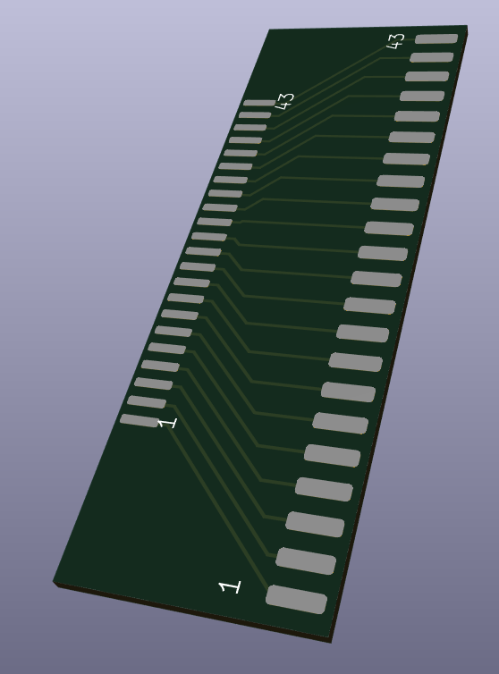

# 44 pin 2.5" IDE to 44pin 1,8" IDE converter for Iriver H1XX/H3XX project
This PCB, designed using KiCad, was design to be used with an SD-Card to IDE converter.
These converters come with 44pin IDE connectors used on 2,5" Harddisks.
These old MP3 players (and others) used 1,8" Harddisk, which have a smaller pin spacing (1.27mm instead of 2,0mm)
In order to connect an SD-Card to IDE converter to the Iriver H120 44pin HDD connector, within the limited room of the player,
I though it was easiest to use this PCB design as an edge connector.
On One side the PCB can be soldered between the 2 rows of pins of the IDE converter, on the other side a 1,27mm spaced 44x2 connector can be soldered,
with its pins on both sides of the PCB. In order to fit, the PCB has been set up to be 0.8mm thick

# SW Version
* KiCad 7.0
## TODO's
solder pads for both footprints might be made a little longer, now when putting it together, the connector pins cover the entire solder pads (in width and length)
## BOM
Besides the SD-Card to IDE converter [Aliexpress](https://nl.aliexpress.com/item/4001146603163.html), only one component is needed:
* Double row 44(50) pin 1.27mm female connector [Aliexpress](https://nl.aliexpress.com/item/4001127977216.html)
## Pictures

